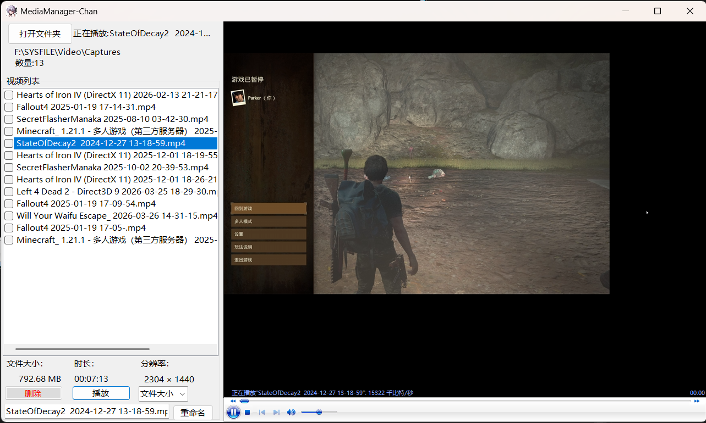
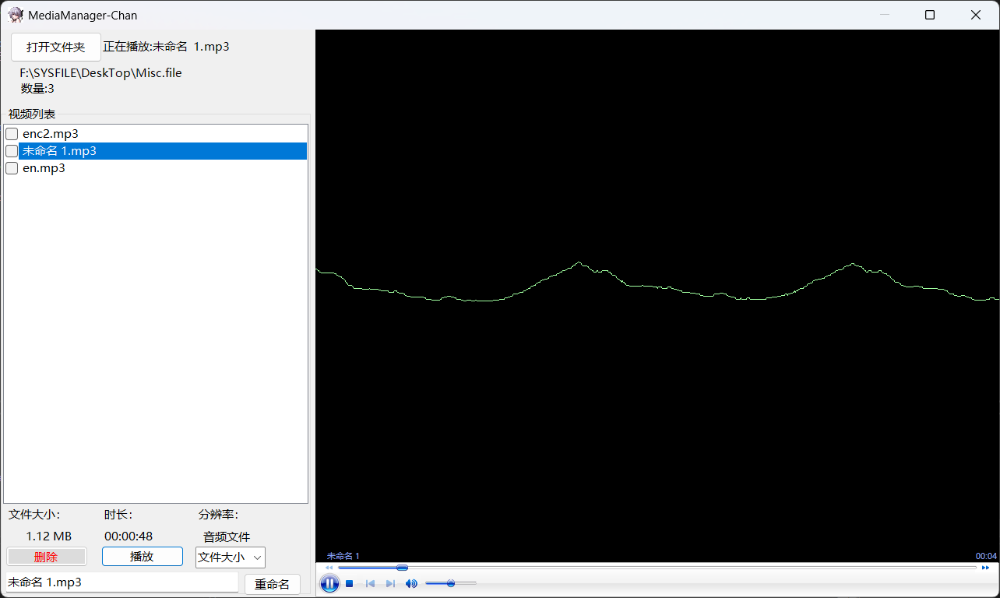
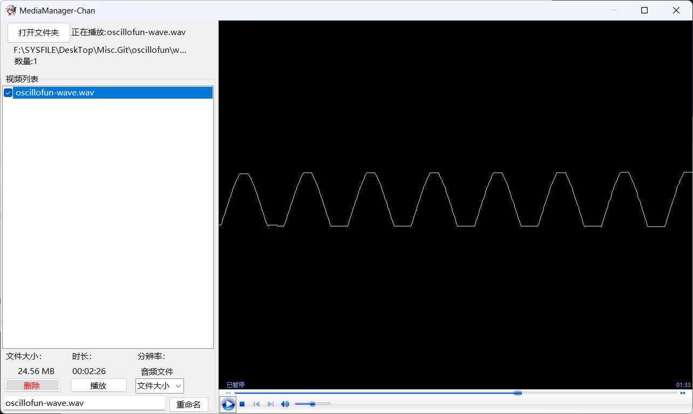

# MediaManager-Chan

用Winform构建的一个简易轻量媒体管理工具 旨在预览文件夹中的媒体并在单一操作窗口删除和重命名（RD）

- 基于`Winform`框架构建 视频预览通过 `Windows Media Player`实现 解析通过 `FFProbe` 实现。

- [特性](#特性)
- [支持类型](#支持类型)
- [为什么要做这个](#为什么要做这个)
- [预览](#预览)

## 特性

- 预览文件夹中的媒体文件
- 删除选中的媒体文件
- 重命名选中的媒体文件
- 支持批量删除操作
- 简单易用的界面设计

## 支持类型

```
mp4、 avi、 mkv、 flv、 mov、flv
mp3、 wav、 flac、 midi
```

## 为什么要做这个

只是巧需和WinForm重温

## 预览




